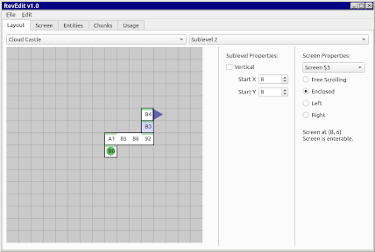
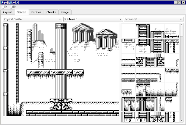

# Castlevania II: Belmont's Revenge: Editor & Data Extraction Scripts

## Editor

 

Windows: [Download Stable](https://github.com/nstbayless/cv2br-editor/releases) | [Dev](https://github.com/nstbayless/cv2br-editor/actions/workflows/build.yml)

Alternatively, clone this repo and run `python3 -m pip install PySide6 && python3 ./gui.py`.

## Data Extraction

This repository provides a script (`build.sh`) which can be run to extract some of the data from a ROM of *Castlevania II: Belmont's Revenge*, such as the level objects and tiles. If you don't have a bash interpreter and aren't able to run .sh files, you can instead run the python script directly. (Remember to install PIL first.)

Supported roms: us/eu, jp, kgb4ceu

python3.8 is requied to run the script.

(Optional): z80-asm is required to assemble the resulting data.
